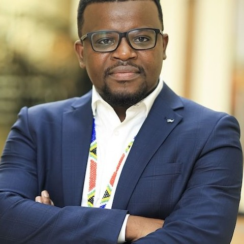
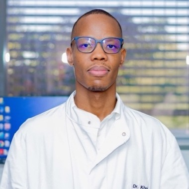
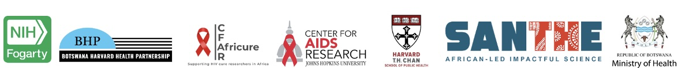

::: {.grid}

::: {.g-col-12}

# Bioinformatics, AI and Data Science

### Bioinformatics Series in Botswana · 2026
:::

::: {.g-col-12}

## Teaching Team

**Prof. Catherine Koofhethile** · *Organizer & BHP Training and Development Manager*

**Dr. Malika Aid Boudries** · *Invited Instructor*

**Dr. Wonderful T. Choga** · *Co-Organizer and Instructor: AI*

**Mr. Phenyo Sabone** · *Co-Organizer & Technical Support*

\

🗓️ **16 and 17 July 2026**

⏰ **08:30 – 16:30**

🏨 **Cresta Hotel, Somora Drive, Gaborone, Botswana**

🤝 **Hosted by BHP and the Harvard T.H. Chan School of Public Health**

✍️ **[Complete the PreAssessment](https://forms.cloud.microsoft/r/zmADzApJ7v){target="_blank"}**

:::

:::

## Overview

This two-day workshop will prepare you to bring bioinformatics, AI, and data
science to bear on real biological questions — and, just as importantly, to
recognise when they don't apply.

::: {.callout-important}
## Exceptional demand
More than **4,000 people applied** to join this workshop. **100** were selected
for in-person participation, drawn from across all sectors, with a further
**600** attending virtually.
:::

## Who is it for?

Anyone working with data in health and disease who wants a foundation in
bioinformatics and data science — and a working awareness of what AI can and
cannot do for their research. No command line experience necessary; some data
analysis in R is a plus.

::: {.grid}
::: {.g-col-6}
1. Research scientists
2. Medical practitioners and clinicians
3. Laboratory scientists and technologists
4. Postgraduate students (MSc, PhD)
5. Undergraduate students in the life sciences
6. Molecular biologists
7. Virologists and immunologists
8. Epidemiologists
:::
::: {.g-col-6}
9. Public health professionals
10. Biostatisticians and data analysts
11. Data managers
12. Early-career bioinformaticians
13. Clinical research staff and study coordinators
14. Pharmacists and pharmacologists
15. Lecturers and academic staff
:::
:::

## Prework

Two things before you arrive:

1. **Complete the [PreAssessment](https://forms.cloud.microsoft/r/zmADzApJ7v){target="_blank"}.**
   It takes a few minutes and tells us who is in the room.

2. **Install the software.** Bring a laptop with R, RStudio, and the Day 2
   tools (AliView, IQ-TREE 3, FigTree 1.4.4, BEAST 1.10.5) already installed —
   see [Installation](installation-instructions.qmd) for step-by-step
   instructions.

::: {.callout-tip}
## Install before you travel
Mr. Sabone runs a setup session at 9:00 on both mornings, but the downloads are
large and conference wifi is not. Arriving with software installed will save
you an hour and let you spend it on the science instead.
:::

If you have a dataset and a question from your own work, bring those too.

## Schedule

### Day 1: Multi-OMICS, Machine Learning and AI Ethics
**Thursday 16 July 2026**

| Time | Session | Facilitator |
|------|---------|-------------|
| 8:30 – 8:45 | Registration and Welcome Remarks | Prof. Catherine Koofhethile |
| 8:45 – 9:00 | Introduction and Overview of the Course & Materials | Dr. Malika Aid Boudries & Dr. Choga |
| 9:00 – 9:45 | Installation of Applications / Software | Mr. Sabone |
| 9:45 – 10:15 | *Tea Break* | |
| 10:15 – 12:45 | Multi-OMICS profiling in HIV using advanced ML techniques  <em>Includes proteomics + metabolomics integration; short breaks throughout</em> | Dr. Malika Aid Boudries |
| 12:45 – 13:45 | *Lunch* | |
| 13:45 – 14:45 | AI in Medical Research and Ethical Considerations | Dr. Choga |
| 14:45 – 15:00 | *Health Break* | |
| 15:00 – 16:00 | Integration & Coding (Practical) & Course Evaluation | Dr. Choga |
| 16:00 – 16:30 | Certificates and Closing Remarks | Dr. Malika Aid Boudries, Dr. Choga & Prof. Catherine Koofhethile |

### Day 2: Biomarker Discovery, Viral Evolution and Phylogenetics
**Friday 17 July 2026**

| Time | Session | Facilitator |
|------|---------|-------------|
| 8:30 – 8:45 | Registration and Welcome Remarks | Prof. Catherine Koofhethile |
| 8:45 – 9:00 | Installation of Applications / Software | Mr. Sabone |
| 9:00 – 9:45 | Biomarker discovery using bulk RNA-Seq | Dr. Malika Aid Boudries |
| 9:45 – 10:15 | *Tea Break* | |
| 10:15 – 11:30 | Single cell multiome profiling in CD4 T cells in SIV-infected NHP | Dr. Malika Aid Boudries |
| 11:30 – 12:45 | SIV/HIV integration site profiling | Dr. Malika Aid Boudries |
| 12:45 – 13:45 | *Lunch* | |
| 13:45 – 15:15 | Principles of Viral Evolution (Bioinformatics)  <em>Using AliView + RStudio</em> | Dr. Choga & Dr. Malika Aid Boudries |
| 15:15 – 15:30 | *Health Break* | |
| 15:30 – 16:00 | Principles of Phylogenetics & Phylodynamics (Bioinformatics)  <em>Using IQ-TREE 3, FigTree 1.4.4, BEAST 1.10.5, RStudio</em> | Dr. Choga |
| 16:00 – 16:30 | Certificates and Closing Remarks | Dr. Malika Aid Boudries, Dr. Choga & Prof. Catherine Koofhethile |

## Software

R · RStudio · AliView · IQ-TREE 3 · FigTree 1.4.4 · BEAST 1.10.5

All are free and open source. See [Installation](installation-instructions.qmd).

## Instructors

{.headshot fig-alt="Prof. Catherine Koofhethile"}
**Prof. Catherine Koofhethile** is an Organizer of this workshop
and the Training and Development Manager at the Botswana Harvard Partnership,
opening and closing both days. She is a Principal Research Scientist at BHP and
Principal Investigator of the Phodiso study, a cohort of adolescents and young
adults living with HIV, and holds an adjunct Professor position at the
University of Venda, South Africa. She completed her postdoctoral fellowship at
the Harvard T.H. Chan School of Public Health under Professors Shapiro, Essex,
and Kanki, and is a visiting research fellow at the Ragon Institute of MGH, MIT
and Harvard, working with Professors Mathias Lichterfeld and Xu Yu. Her research
focuses on the genetic composition of the HIV proviral reservoir and the immune
and other factors that drive HIV to persist long-term, including in Botswana
adolescents receiving long-term ART, and she leads BHP's efforts to establish an
adolescent HIV cure research programme and to build capacity by co-mentoring
junior researchers. Her work has been supported by Fogarty, Harvard CFAR,
SANTHE, and the Povinelli and Campbell Foundations, among others, with current
funding including the SANTHE Path to Independence and NIH-K43 Global Leader
awards. She was recently named SANTHE Outstanding Contributor of the Year and
shortlisted for the 2025 Nature Awards.

{.headshot fig-alt="Dr. Malika Aid Boudries"}
**Dr. Malika Aid Boudries** is the Invited Instructor for this
workshop, leading the multi-OMICS and machine learning sessions. She is an
Assistant Professor of Medicine and Principal Investigator at the Center for
Virology and Vaccine Research at Harvard Medical School, where she leads research
at the intersection of bioinformatics, OMICS technologies, artificial
intelligence, immunology, and vaccine development. She serves as Director of the
Harvard Center for AIDS Research (CFAR) Artificial Intelligence Committee,
Director of the CFAR Pathways Initiative Program, and a core member of the CFAR
Basic Research Committee. With an interdisciplinary foundation spanning an
engineering degree in computer science, a master's in immunology and molecular
biology, and a PhD in computational biology, genomics, and bioinformatics, her
work has advanced the understanding of high-priority pathogens — including Zika
virus, SARS-CoV-2, HIV, H5N1 and seasonal influenza, and mpox — investigating
viral persistence, immune evasion, host–virus interactions, and vaccine-induced
immunity. She is Principal Investigator of an NIH Director's New Innovator Award
for work on host-dependent mechanisms guiding viral integration, and contributes
to major NIH, Bill & Melinda Gates Foundation, and industry programs on broadly
neutralizing antibodies, therapeutic vaccination, HIV vaccine innovation, and
multi-omics immune profiling. She has authored more than 50 peer-reviewed
publications in Nature, Science, and Cell across single-cell multi-omics,
genomics, epigenetics, and the design of drugs and vaccines for emerging and
persistent pathogens.

{.headshot fig-alt="Dr. Wonderful T. Choga"}
**Dr. Wonderful T. Choga** is Co-Organizer of this workshop and Instructor for
AI. He holds a PhD in Medical Sciences (Pandemic Response) from the University
of Botswana and an MSc(Med) in Human Genetics from the University of Cape Town.
He is Head of the Bioinformatics Unit, Senior Bioinformatician, and
Postdoctoral Research Scientist in Medical Virology at the Botswana Harvard
Health Partnership, and serves as Adjunct Lecturer in Medical Virology and
Bioinformatics at the University of Zimbabwe and Senior Lecturer in
Bioinformatics at the National University of Science and Technology
(Zimbabwe). A recipient of the Harvard Global Health Institute Fellowship and
the Rockefeller Foundation–Africa CDC Public Health Fellowship, his research
integrates artificial intelligence, pathogen genomics, phylogenomics, and
genomic surveillance to advance precision public health across Africa. He has
authored more than 70 peer-reviewed publications with over 3,500 citations
(H-index 13), and is passionate about mentoring the next generation of African
scientists.

{.headshot fig-alt="Mr. Phenyo Sabone"}
**Mr. Phenyo Sabone** is Co-Organizer of this workshop and serves as Health
Informatics Officer, Data Manager, and Information Technology Professional at the
Botswana Harvard Health Partnership. With over a decade of experience across
health informatics, systems administration, biomedical research, and data
management, he specialises in clinical and laboratory information systems,
research data platforms, bioinformatics, and digital health solutions. He holds
an MBA in Management Information Systems and a BSc (Hons) in Software Engineering
with Multimedia. Previously a Senior System Administrator managing enterprise
Linux infrastructure, virtualization, network services, cybersecurity,
databases, and research computing, he now supports clinical and laboratory
research by developing and managing electronic data capture systems, ensuring
data quality, supporting bioinformatics pipelines, and integrating research
information systems for HIV, genomics, infectious disease, and precision medicine
research. He helps coordinate the scientific programme, technical sessions, and
hands-on training for this course — and runs the software installation sessions
on both mornings — while also supporting continental bioinformatics capacity
building through H3ABioNet. His interests span health data science, AI in
healthcare, bioinformatics, precision medicine, and digital health across Africa.

See [About](about.qmd) for the full teaching team and our
[past workshops](past_workshops.qmd).

## Partners & Sponsors

This workshop is hosted by the **Botswana Harvard Health Partnership** and the
**Harvard T.H. Chan School of Public Health**, with the support of our partners
and funders.

{.sponsors-strip fig-alt="Partner and sponsor logos: NIH Fogarty, Botswana Harvard Health Partnership, CFAR Africure, Johns Hopkins Center for AIDS Research, Harvard T.H. Chan School of Public Health, SANTHE, and the Republic of Botswana Ministry of Health"}
