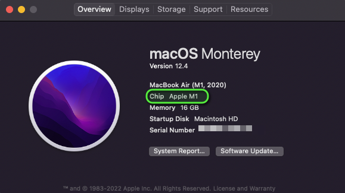
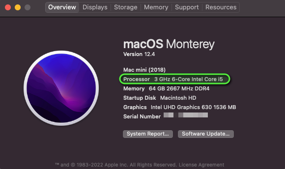

*R/RStudio sections adapted from [datacarpentry.org](https://datacarpentry.org)*

Please install everything **before you arrive**. Mr. Sabone will run a setup
session at 9:00 on both mornings, but the downloads are large and conference
wifi is not — arriving with software already installed will save you an hour.

::: {.callout-important}
## What you need
| Software | Needed for | Day |
|---|---|---|
| **R** (4.3.1+) | Everything | 1 & 2 |
| **RStudio** (2023.09+) | Everything | 1 & 2 |
| **AliView** | Viral evolution — sequence alignment | 2 |
| **IQ-TREE 3** | Phylogenetics — tree building | 2 |
| **FigTree 1.4.4** | Phylogenetics — tree visualisation | 2 |
| **BEAST 1.10.5** | Phylodynamics | 2 |
:::

# R and RStudio

R is the statistical computing environment; RStudio is the interface that makes
it usable. They are separate downloads and **R must be installed first**. Once
both are in place you only ever open RStudio, which runs R in the background.

Install `R version 4.3.1` or later and `RStudio version 2023.09.0` or later.

## Step 1 — follow the instructions for your operating system

#### For Windows see **@sec-windows**

#### For MacOS see **@sec-mac**

#### For Linux see **@sec-linux**

## Step 2 — install the R packages

Open RStudio and paste the following into the console (bottom-left). It will
take several minutes.

**Core — everyone needs these:**

```{.r .code-overflow-wrap}
install.packages(c("tidyverse", "here", "knitr", "rmarkdown", "quarto",
                   "janitor", "broom", "patchwork", "cowplot", "colorspace",
                   "ggrepel", "ggbeeswarm", "pheatmap", "RColorBrewer"))
```

**Machine learning and multi-OMICS (Day 1):**

```{.r .code-overflow-wrap}
install.packages(c("tidymodels", "glmnet", "randomForest", "caret",
                   "umap", "Rtsne", "factoextra", "cluster"))
```

**Phylogenetics (Day 2):**

```{.r .code-overflow-wrap}
install.packages(c("ape", "phangorn", "phytools", "seqinr"))
```

**Bioconductor — RNA-Seq, single cell, and tree plotting (Days 1 & 2):**

```{.r .code-overflow-wrap}
if (!require("BiocManager", quietly = TRUE)) install.packages("BiocManager")
BiocManager::install(c("DESeq2", "edgeR", "limma", "mixOmics",
                       "ggtree", "treeio", "ComplexHeatmap"))
```

::: {.callout-tip}
## Check it worked
```{.r .code-overflow-wrap}
library(tidyverse); library(ape); library(DESeq2)
sessionInfo()
```
If those three load without error, you are ready. If a package failed, note
which one and bring it to the setup session.
:::

::: {.callout-note}
## Single cell (optional, large)
The single cell multiome session uses `Seurat`. It is a big install with many
dependencies — do it in advance, on a good connection, or follow along without
running the code.

```{.r .code-overflow-wrap}
install.packages("Seurat")
```
:::

# Bioinformatics tools {#sec-tools}

These are standalone applications, not R packages. Day 2 only.

## AliView — sequence alignment viewer

Download from [ormbunkar.se/aliview/](https://ormbunkar.se/aliview/){target="_blank"}.
Available for Windows, MacOS, and Linux. Requires Java — if AliView will not
start, install Java from [adoptium.net](https://adoptium.net/){target="_blank"}
and try again.

## IQ-TREE 3 — maximum likelihood trees

Download from [iqtree.github.io](https://iqtree.github.io/){target="_blank"}.

IQ-TREE runs from the command line. Unzip it somewhere you can find, then test
it from a terminal:

```{.bash}
# MacOS / Linux
./iqtree3 --version

# Windows (Command Prompt, from the folder you unzipped into)
iqtree3.exe --version
```

## FigTree 1.4.4 — tree visualisation

Download from
[github.com/rambaut/figtree/releases](https://github.com/rambaut/figtree/releases){target="_blank"}.
Also requires Java.

## BEAST 1.10.5 — phylodynamics

Download from
[beast.community/installing](https://beast.community/installing){target="_blank"}.
Requires Java. The BEAST package includes BEAUti, which you will use to set up
the analysis.

::: {.callout-warning}
## Java is the common failure point
AliView, FigTree, and BEAST all need Java. If any of them refuse to open, Java
is the first thing to check. Install it from
[adoptium.net](https://adoptium.net/){target="_blank"} (Temurin 17 or later is
fine) and restart the application.
:::

## Windows {#sec-windows}

### If you don’t have R and RStudio installed:

Go to [https://posit.co/download/rstudio-desktop/](https://posit.co/download/rstudio-desktop/) and follow this instruction for windows.

### If you already have R and RStudio installed, check to see if updates are available. 

RStudio: Open RStudio and click on Help > Check for updates. If a new version is available, quit RStudio, and download the latest version. 

R: Upon starting RStudio, the version of R you are running will appear on the console. You can also type `sessionInfo()` in the console to display the version of R you are running. The CRAN website will tell you if there is a more recent version available. You can update R using the `installr` package, by running: 

```{.r .code-overflow-wrap}
# installr is for windows only!
if( !("installr" %in% installed.packages()) ){install.packages("installr")} 

installr::updateR(TRUE) 
```

## MacOs {#sec-mac}


### Check your processor {.text-left}
*adapted from [https://docs.cse.lehigh.edu/determine-mac-architecture/](https://docs.cse.lehigh.edu/determine-mac-architecture/)*

Make sure you are downloading and installing the right version of R and R Studio for your laptop's CPU. Some Macs have an intel chip (also known as x64 or x86_64 architecture), while the newest macs have M1 or M2 chips (also known as ARM architecture).

To determine whether a Mac is running an Intel Processor or Apple ARM M1 or M2, click on the  Apple Menu and select 'About this Mac':


From the 'About this Mac' screen, on the 'Overview' tab, look for a line that indicates either 'Chip' or 'Processor'. If the line contains M1 or M2, the machine is running Apple Silicon. Alternatively, the word Intel indicates that the machine is running an Intel-based Core series processor.





### If you don’t have R and RStudio installed:

Go to [https://posit.co/download/rstudio-desktop/](https://posit.co/download/rstudio-desktop/) and follow this instruction for MacOS.

### If you already have R and RStudio installed, check to see if updates are available.

**RStudio:** Open RStudio and click on Help > Check for updates. If a new version is available, quit RStudio, and download the latest version.

**R:** Upon starting RStudio, the version of R you are running will appear on the console. You can also type sessionInfo() to display the version of R you are running. The CRAN website will tell you if there is a more recent version available. For this workshop install version 4.3.1 of R

## Linux {#sec-linux}

### If you don’t have R and RStudio installed:

Go to [https://posit.co/download/rstudio-desktop/](https://posit.co/download/rstudio-desktop/) and follow this instruction for your Linux OS.

### If you already have R and RStudio installed, check to see if updates are available.

**RStudio:** Open RStudio and click on Help > Check for updates. If a new version is available, quit RStudio, and download the latest version.

**R:** Upon starting RStudio, the version of R you are running will appear on the console. You can also type sessionInfo() to display the version of R you are running. The CRAN website will tell you if there is a more recent version available. For this workshop install version 4.3.1 of R

