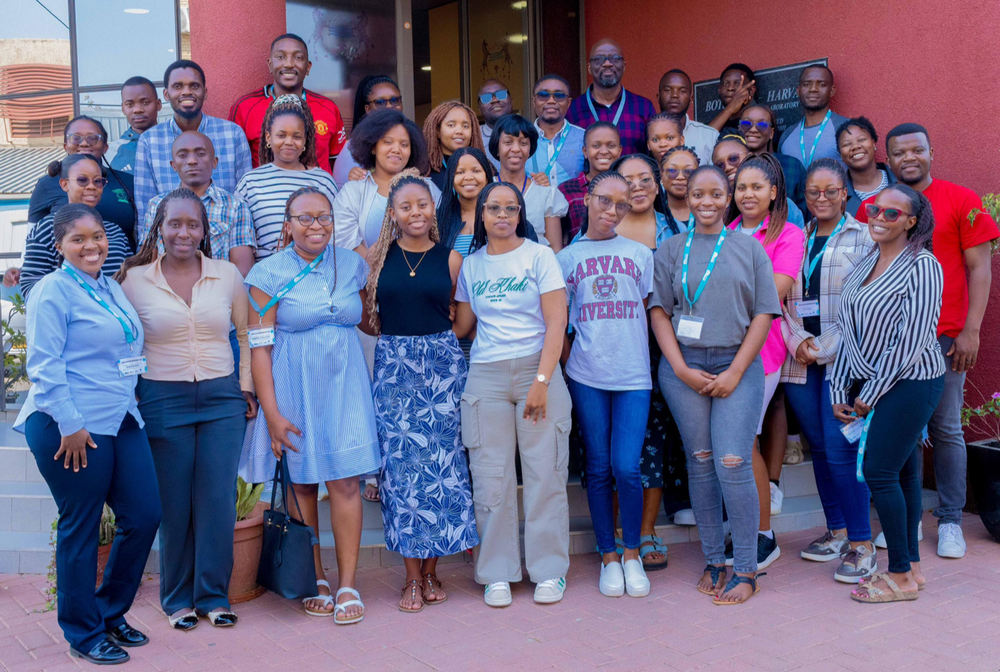
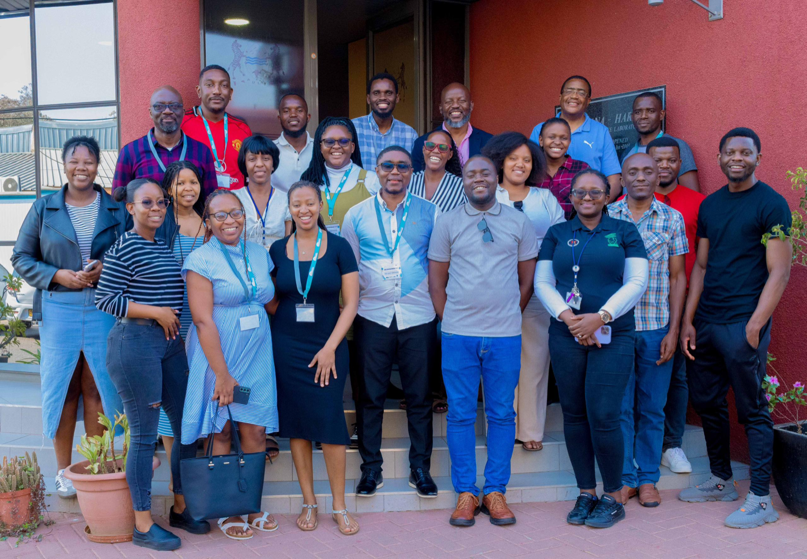

# Virus Evolution and Genomics Workshop

**8–12 September 2025 · Gaborone, Botswana**

## Strengthening African research collaboration and capacity

The Virus Evolution and Genomics Workshop brought together **46 in-person
participants** from across the African continent. The five-day workshop,
aligned with the **SANTHE–Gates Foundation** collaboration, aimed to enhance
regional expertise in viral genomics, phylogenetics, and outbreak
investigation.

The workshop served as a platform to harmonize analytical approaches across
African research sites, build practical bioinformatics skills, and foster
collaborative networks among early-career and senior scientists.

::: {.callout-note}
## Who was in the room
Participants came from **Botswana, Zimbabwe, Uganda, Zambia, Cameroon, Kenya,
Nigeria, South Africa, and Malawi**, with multiple institutions represented in
each country.

They included MSc and PhD students, postdoctoral researchers, medical
scientists, lecturers, and junior faculty working in virology, bioinformatics,
molecular biology, epidemiology, statistics, and public health.
:::

## What was covered

Training was intensive and hands-on, focused on molecular epidemiology,
sequence alignment, phylogenetic inference, mutation profiling, and
phylogeography — with an emphasis on applying these skills in real-time genomic
surveillance and outbreak response.

| Day | Focus | Led by |
|---|---|---|
| **Monday 8 Sept** | Welcome and introduction; workshop structure and objectives; overview of the SANTHE–Gates Foundation grant; keynote on the foundations of virus evolution and phylogenetics; establishing collaborative cross-country research initiatives | Dr. Gaerolwe Masheto (BHP COO), Prof. Sikhulile Moyo, Dr. Simani Gaseitsiwe, Dr. Wonderful Choga |
| **Tuesday 9 Sept** | Lecture on mutational analysis; practical training in sequence alignment, mutation analysis, and annotation using 3D protein scaffolds | Mrs. Natasha O. Moraka-Mankge, Dr. W. Choga and teaching assistant teams |
| **Wednesday 10 Sept** | Phylogenetic tree construction using Maximum Likelihood and Bayesian approaches | Prof. Moyo & Dr. Choga |
| **Thursday 11 Sept** | Applied genomics: viral diversity, genotyping, and genomic surveillance | Faculty team |
| **Friday 12 Sept** | Advanced topics — recombination, and integrating artificial intelligence into genomics; keynote on diversity and using genomics to capture transmitted founder viruses and acute HIV infections | Dr. San E. James, Prof. Moyo |

## Outcomes

::: {.callout-important}
## 85% end-to-end competency
All participants completed practical workflows in phylogenetics and mutation
profiling, with **85% achieving full end-to-end analysis competency** using the
provided datasets.
:::

Beyond the technical training, the workshop produced several durable outcomes:

- **Harmonization across SANTHE sites.** Participants reached agreement on a
  shared set of methodologies for phylogenetic analysis, mutation curation, and
  outbreak data interpretation — expected to improve consistency across African
  sites, reduce duplication, and increase the impact of local and regional
  outbreak responses.
- **A regional viral genomics curriculum** was initiated, with lecture slides,
  tutorials, and datasets archived for future use.
- **A weekly bioinformatics course** was established, providing ongoing
  guidance, mentorship, and a collaborative analysis platform for participants.
- **Slack and WhatsApp groups** were set up to enable peer engagement and
  resource sharing beyond the workshop.
- **New research links** formed across institutions in Botswana, Zimbabwe,
  Uganda, Zambia, Cameroon, Kenya, Nigeria, and South Africa.

The workshop reaffirmed SANTHE's role as a central hub for bioinformatics and
viral evolution training in Africa, supporting the Gates Foundation's broader
vision of a connected, resilient African genomics ecosystem. In addition to
strengthening technical capacity, it fostered mentorship and scientific
relationships by creating opportunities for junior scientists to engage
directly with senior researchers and bioinformatics leaders.

## Next steps

- An online repository of harmonized tools and tutorials.
- Continued mentorship pairing between junior and senior researchers.
- An **advanced Virus Evolution and Genomics Workshop in 2026**, with deeper
  modules on pathogen evolution.
- Expanded funding partnerships to scale harmonized genomic analysis capacity
  to additional African regions.

## Acknowledgements

The workshop was made possible through the support of **SANTHE**, the
**SANTHE–Gates Foundation partnership**, the **Botswana Harvard Health
Institute**, the **University of Botswana**, and partner institutions across
Cameroon, Zimbabwe, Zambia, Uganda, Kenya, Nigeria, and Malawi.

Its success is a testament to the dedication of the faculty facilitators,
collaborating institutions, and the enthusiastic participation of emerging
scientists from across the continent.
