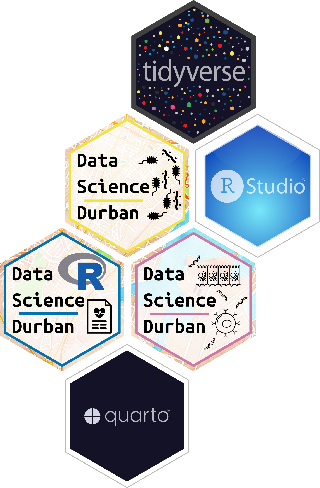

::: {.grid}

<!-- ::: {.g-col-12}

# Bioinformatics Series in Botswana
::: -->

::: {.g-col-6}
<!-- #### Workshop 1 - R, RStudio, and Quarto for clinical research -->
<!-- This week of content will prepare you to use R, RStudio, and Quarto for data analysis in clinical research. -->
:::
::: {.g-col-10  .g-start-1}

:::

<!-- ::: {.g-col-6 .text-start}

{width=50%} 

::: -->

:::
## Workshop I - R, RStudio, and Quarto for clinical research
<b>Thank you for participating in the workshop!</b>

Our week together was amazing, thank you so much for making the workshop a success by participating all week long.

1. If you haven't already, [please fill out this survey](https://docs.google.com/forms/d/e/1FAIpQLSffVuXEzVfK8xb0vzA-WGyBzhnJ3fvpJ_HflAVRum4mHuXQCg/viewform)
2. If you have any photos of the workshop you'd like to share, go to [#photos on the workshop discord](https://discord.com/channels/1158136582201692202/1164886636878889071)
3. Please post on Discord or email us if you have any questions or comments!

<!-- ## Welcome to the workshop!

1. [Fill out the pre-workshop survey here](https://forms.gle/7sdT7YRJerdgFJcc7)  
2. [Fill out the icebreaker survey here](https://forms.gle/6FAJ5Qa78qUkwvdu8)  
3. [Join the discord here](https://discord.gg/UDAsYTzZE) (once you've joined, you can bookmark [https://discord.com/channels/1158136582201692202/](https://discord.com/channels/1158136582201692202/) to go straight to the channel.)  
4. Get your RStudio and R installation checked by an instructor or TA

## Before the workshop: Installing R and RStudio

Please install R and RStudio on your laptop. If you already have R and Rstudio installed, please make sure they are up-to date. Please install `R version 4.3.1` and `RStudio version 2023.09.0` [Click here for instructions on installing R and RStudio](installation-instructions.qmd)
 -->

| Date/Time  | Topic  | Instructor|
|--------|--------|--------|
| **Monday, October 16^th^**  | --|-- |
| AM   | Course Introduction & Introduction to data types | Salina Hussain and Suuba Demby (Ragon Institute)|
| PM | Intro to R, Rstudio, and Quarto  | Chandani Desai and Joseph Elsherbini (Ragon Institute) |
| **Tuesday, October 17^th^**  |-- |-- |
| AM   | Intro to data visualizaion with the <code>tidyverse</code> | Scott Handley (Wash U School of Medicine)|
| PM | Data wrangling and more data visualization | Joseph Elsherbini  (Ragon Institute) |
| **Wednesday, October 18^th^**  |-- | --|
| AM   | <code>tableone</code> and statistics for clinical data  | Marothi Letsoalo (CAPRISA)|
| PM | Small group worktime  | Participants |
| **Thursday, October 19^th^**  |-- | --|
| AM   | Hypothesis testing and data transformations | Laura Symul (UCLouvain)|
| PM | Small group worktime  | Participants |
|Evening|Reception||
| **Friday, October 20^th^**  |-- | --|
| AM   | Keynote | Lenine Liebenberg (CERI Stellenbosch)|  
| | Small group work time | Participants |  
| PM | Small group presentations | |Small group work time | Participants |
: Schedule {#tbl-1 .table-bordered .table-sm}

