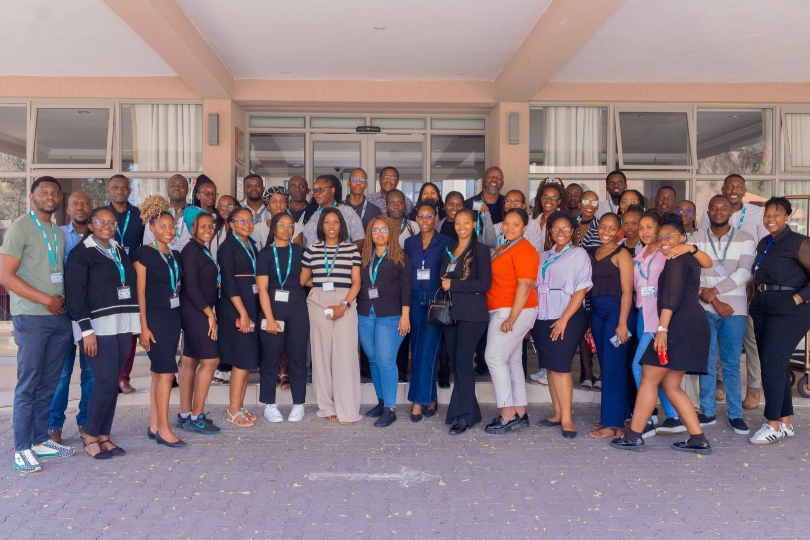
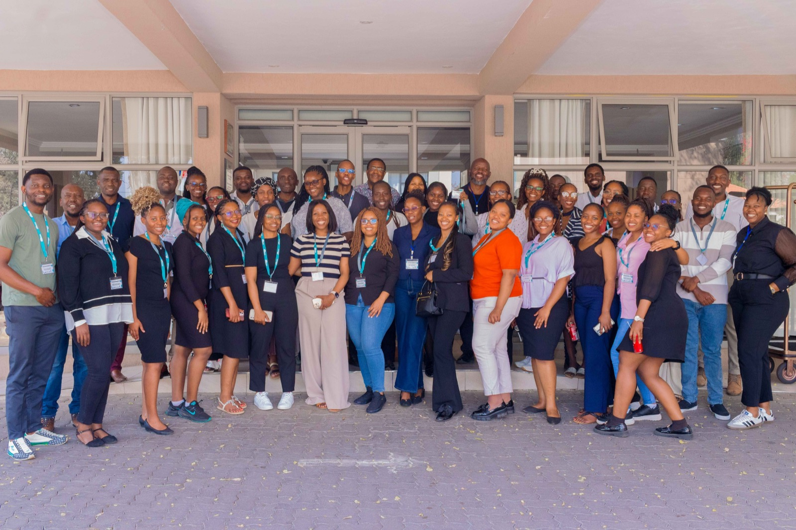
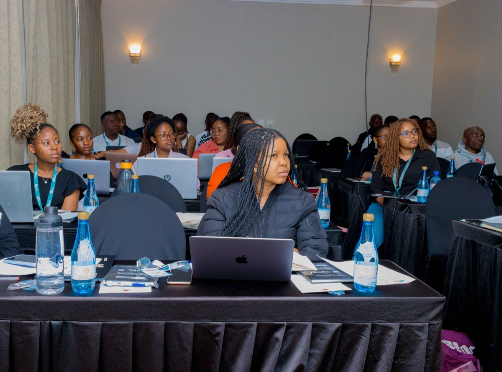
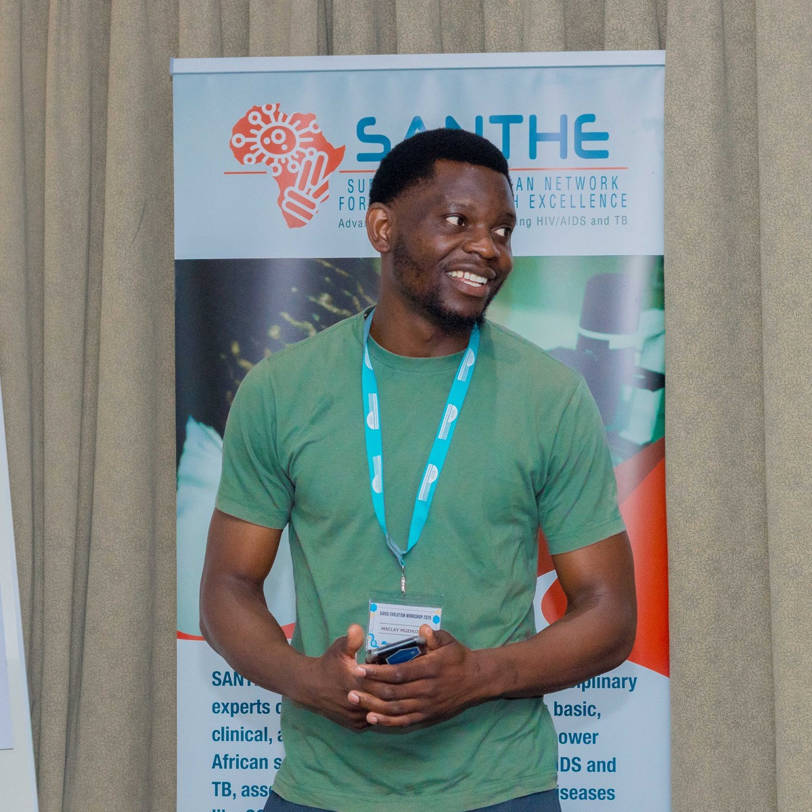
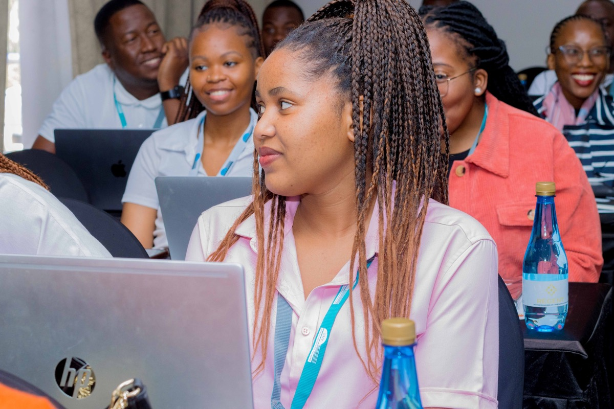
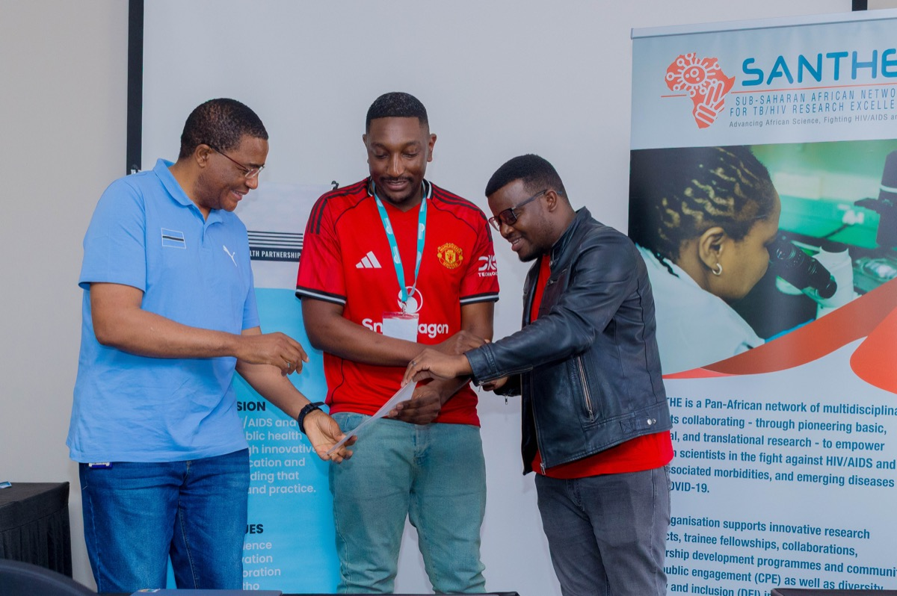
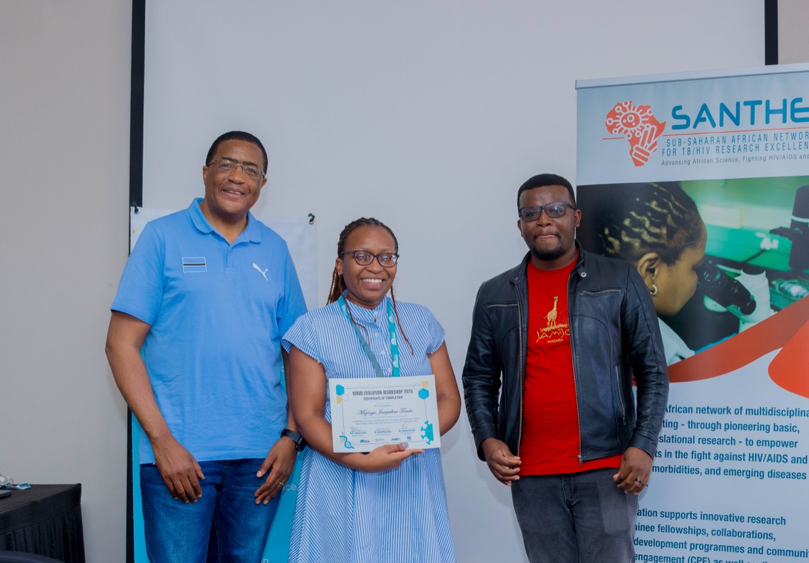
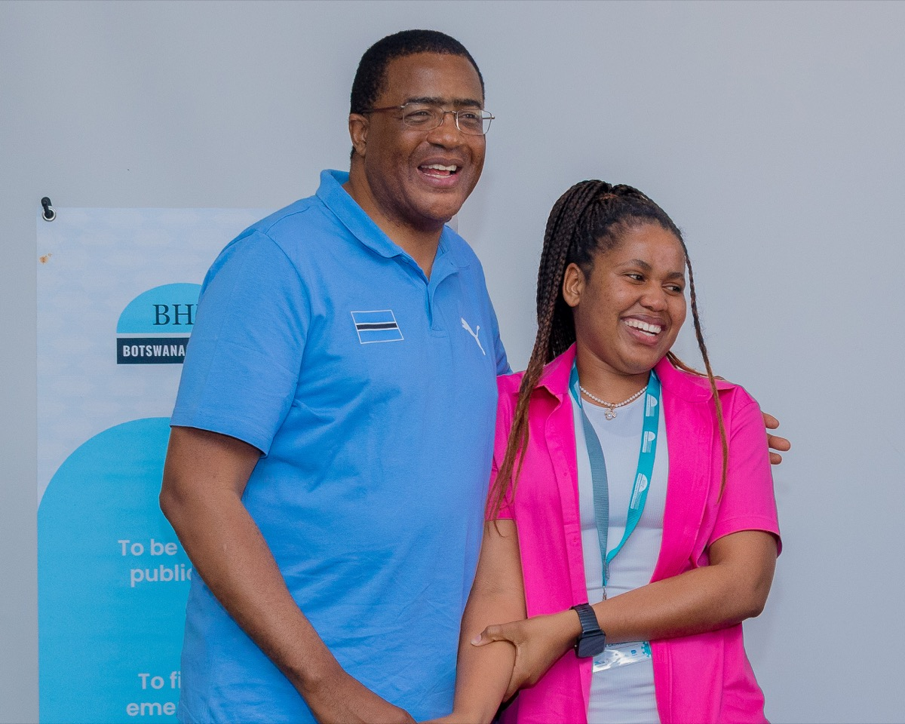
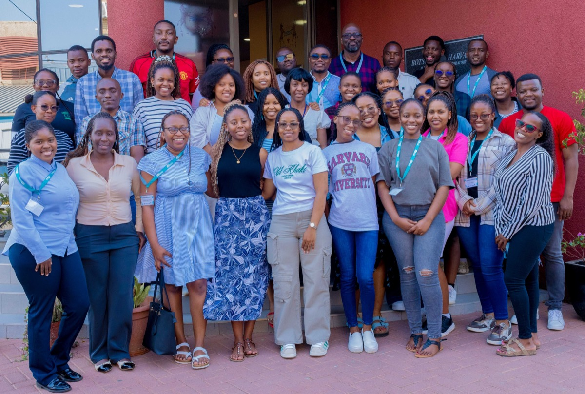

# Virus Evolution and Genomics Workshop

**8–12 September 2025 · Gaborone, Botswana**

## Strengthening African research collaboration and capacity

The Virus Evolution and Genomics Workshop brought together **46 in-person
participants** from across the African continent. The five-day workshop,
aligned with the **SANTHE–Gates Foundation** collaboration, aimed to enhance
regional expertise in viral genomics, phylogenetics, and outbreak
investigation.

The workshop served as a platform to harmonize analytical approaches across
African research sites, build practical bioinformatics skills, and foster
collaborative networks among early-career and senior scientists.

::: {.callout-note}
## Who was in the room
Participants came from **Botswana, Zimbabwe, Uganda, Zambia, Cameroon, Kenya,
Nigeria, South Africa, and Malawi**, with multiple institutions represented in
each country.

They included MSc and PhD students, postdoctoral researchers, medical
scientists, lecturers, and junior faculty working in virology, bioinformatics,
molecular biology, epidemiology, statistics, and public health.
:::

## What was covered

Training was intensive and hands-on, focused on molecular epidemiology,
sequence alignment, phylogenetic inference, mutation profiling, and
phylogeography — with an emphasis on applying these skills in real-time genomic
surveillance and outbreak response.

### Day 1 — Monday 8 September · Foundation & Introduction
*Theme: Virus Evolution and Phylogenetics*

| Time | Session | Led by |
|---|---|---|
| 8:00 – 8:30 | Registration & Welcome Coffee | |
| 8:30 – 10:30 | Opening: Welcome Address; Workshop Objectives; Introduction to the Gates Foundation and SANTHE Partnership; Participant Introductions & Expectations | Dr. Gaerolwe Masheto; Prof. Moyo & Dr. Simani Gaseitsiwe |
| 11:00 – 12:30 | From sample to sequence (step-by-step) | Kedumetse Seru |
| 14:00 – 15:00 | **Keynote:** Current Landscape of Viral Genomics in Africa; From Sanger to NGS; Research Priorities and Opportunities | Prof. Sikhulile Moyo |
| 15:05 – 16:00 | Software installation — MEGA/IQ-TREE, Geneious/UGENE, R/RStudio, command line tools, BEAST, TreeTime | Dr. W. Choga, P. Sabone, F. Kato, K. Mwikali |
| 16:20 – 17:00 | Introduction to the command line | Dr. Wonderful Choga |

### Day 2 — Tuesday 9 September · Sequencing Analysis & Phylogenetics
*Theme: Quality research and sequencing*
*Faculty: Prof. S. Moyo, Prof. Eric Hunter, Dr. W. Choga, Dr. San James · TAs: Natasha, Tsholo, Moses, Kioko, Frank*

| Time | Session |
|---|---|
| 9:00 – 10:30 | Recap; Laboratory Best Practices; Quality Control in Genomic Research; Case Studies from Regional Labs |
| 11:00 – 13:00 | Sanger Sequencing Analysis — chromatograms, freeware options (FinchTV, Chromas), quality assessment; practical on sample sequences |
| 14:00 – 15:00 | Sequence Mining & Editing — GenBank/BLAST navigation, alignment, trimming, FAIR data principles, database submission, metadata standards |
| 15:30 – 17:00 | Next-Generation Sequencing — long vs short read, depth vs coverage, quality metrics, file formats; practical NGS pipeline |

### Day 3 — Wednesday 10 September · Alignments & Phylogenetic Analyses
*Theme: Complex sequence analyses and data interpretation*
*Faculty: Prof. Moyo, Dr. W. Choga, Dr. San James · TAs: Moses, Maclay, Kioko, Frank*

| Time | Session |
|---|---|
| 9:00 – 10:00 | **Keynote:** Trends in HIV research (HIV cure) — Prof. Catherine K. Koofhethile |
| 10:00 – 11:00 | Sequence alignments and introduction to phylogenetics — distance- vs character-based methods, model selection (ModelFinder), maximum likelihood and bootstrapping, Bayesian inference (BEAST), phylogeography, posterior probability |
| 11:15 – 13:00 | Practical: building trees with MEGA/IQ-TREE; parameter optimization; tree visualization and annotation |
| 14:00 – 15:30 | Advanced phylogenetics — time-resolved phylogenies, phylo-tree I/E analysis, phylodynamics, phylo-epi analysis |
| 16:00 – 17:00 | Viral diversity — measuring genetic diversity, population dynamics, transmission cluster and network analysis, source attribution, public health applications |

### Day 4 — Thursday 11 September · Viral Diversity & Recombination
*Theme: Complex viral phenomena*
*Faculty: Dr. San James, Natasha Moraka-Mankge, Derek Tshiabuila, Dr. W. Choga*

| Time | Session |
|---|---|
| 9:00 – 10:00 | Viral mutations — types, significance and interpretation; HIV drug resistance mutations (Natasha); introduction to structural biology and 3D modelling; mutation annotation on 3D scaffolds (Wonderful) |
| 10:15 – 13:00 | Mutation calling and annotation; clinical significance; practical mutation profiling |
| 14:00 – 14:30 | Viral recombination — mechanisms, detection methods (RDP, SimPlot), HIV subtype analysis |
| 15:00 – 17:00 | HIV recency testing — principles of recency assays, molecular markers, integration with surveillance data, PhyloTSI |

### Day 5 — Friday 12 September · Integration & Application
*Theme: Bringing it all together*

| Time | Session |
|---|---|
| 9:00 – 10:00 | Final day overview |
| 10:00 – 11:30 | AI and integrated analysis pipeline — introduction to AI in genomics, complete workflow review, automation options, quality checkpoints |
| 11:45 – 13:00 | Workshop evaluation — feedback, group discussion, suggestions for future workshops |
| 13:00 – 13:20 | Closing ceremony — certificates, closing remarks, networking reception |

::: {.callout-note}
## Materials provided
Workshop manual (digital and print) · software installation guides · sample
datasets · reference materials and key publications · access to online
resources · certificate of completion
:::

## Outcomes

::: {.callout-important}
## 85% end-to-end competency
All participants completed practical workflows in phylogenetics and mutation
profiling, with **85% achieving full end-to-end analysis competency** using the
provided datasets.
:::

Beyond the technical training, the workshop produced several durable outcomes:

- **Harmonization across SANTHE sites.** Participants reached agreement on a
  shared set of methodologies for phylogenetic analysis, mutation curation, and
  outbreak data interpretation — expected to improve consistency across African
  sites, reduce duplication, and increase the impact of local and regional
  outbreak responses.
- **A regional viral genomics curriculum** was initiated, with lecture slides,
  tutorials, and datasets archived for future use.
- **A weekly bioinformatics course** was established, providing ongoing
  guidance, mentorship, and a collaborative analysis platform for participants.
- **Slack and WhatsApp groups** were set up to enable peer engagement and
  resource sharing beyond the workshop.
- **New research links** formed across institutions in Botswana, Zimbabwe,
  Uganda, Zambia, Cameroon, Kenya, Nigeria, and South Africa.

The workshop reaffirmed SANTHE's role as a central hub for bioinformatics and
viral evolution training in Africa, supporting the Gates Foundation's broader
vision of a connected, resilient African genomics ecosystem. In addition to
strengthening technical capacity, it fostered mentorship and scientific
relationships by creating opportunities for junior scientists to engage
directly with senior researchers and bioinformatics leaders.

## Next steps

- An online repository of harmonized tools and tutorials.
- Continued mentorship pairing between junior and senior researchers.
- An **advanced Virus Evolution and Genomics Workshop in 2026**, with deeper
  modules on pathogen evolution.
- Expanded funding partnerships to scale harmonized genomic analysis capacity
  to additional African regions.

## Gallery

::: {layout-ncol=2}

{group="gallery"}

{group="gallery"}

{group="gallery"}

{group="gallery"}

{group="gallery"}

{group="gallery"}

{group="gallery"}

{group="gallery"}

:::

## Acknowledgements

The workshop was made possible through the support of **SANTHE**, the
**SANTHE–Gates Foundation partnership**, the **Botswana Harvard Health
Institute**, the **University of Botswana**, and partner institutions across
Cameroon, Zimbabwe, Zambia, Uganda, Kenya, Nigeria, and Malawi.

Its success is a testament to the dedication of the faculty facilitators,
collaborating institutions, and the enthusiastic participation of emerging
scientists from across the continent.
